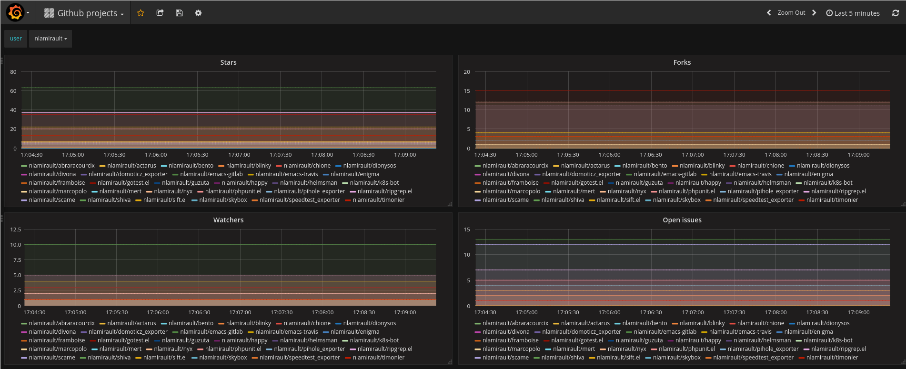
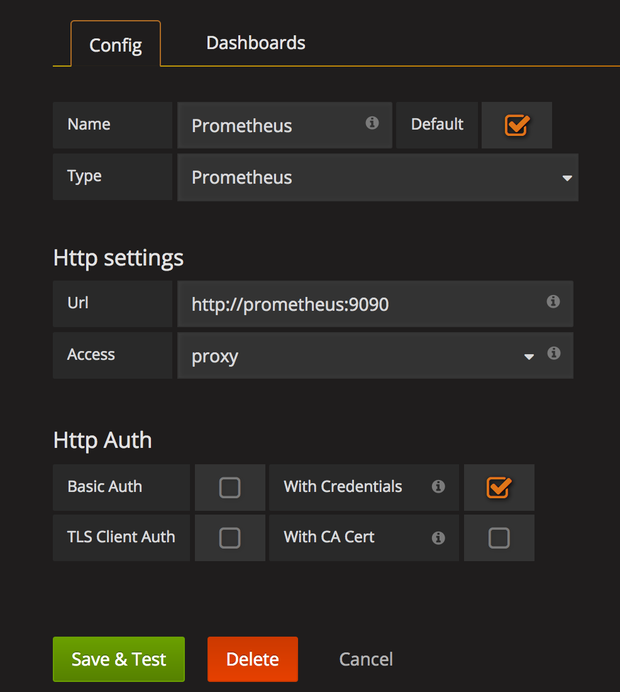

Github monitoring
=================

## Description

A Docker stack which monitors my Github repositories

## Installation

* Clone the repository

* Change in **docker-compose.yml** file the *REPOS* and *ORGS* variable to your repositories and organizations

* Create a personal access token inside of GitHub. This token will allow you to query the GitHub API more frequently than a public user. It is only necessary to give the repo scope to the token permission.

* Creates a *github.env* file and setup your Github token :

        GITHUB_TOKEN=xxxxx

* Start the stack : 

        docker-compose up -d

* The Grafana Dashboard is now accessible via: http://<Host IP Address>:3000

* Prometheus is accessible via: http://<HOST IP address>:9090

* Metrics exporter is accessible via: http://<HOST IP address>:9171

## Usage

### Setup Prometheus into Grafana

Now we need to create the Prometheus Datasource in order to connect Grafana to Prometheues

* Click the Grafana Menu at the top left corner (looks like a fireball)
* Click Data Sources
* Click the green button Add Data Source.

### Install Dashboard

Import the dashboard **github-dashboard.json** into Grafana.

